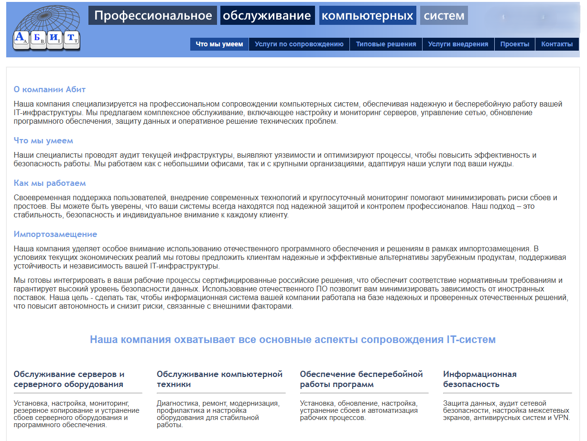
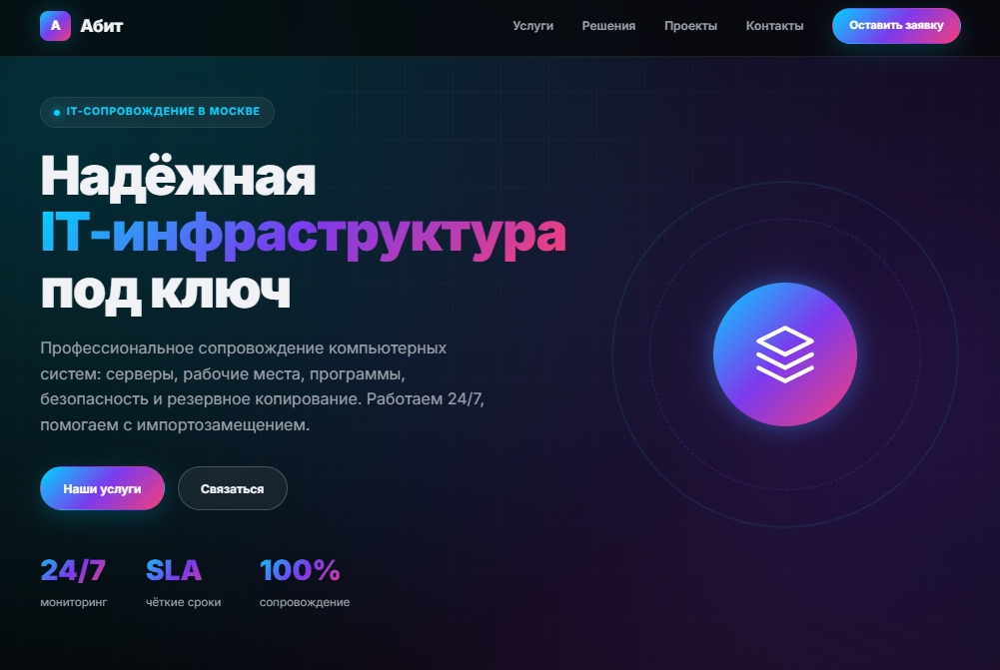

# Новый корпоративный сайт для ООО "___"

## Название проекта

Корпоративный многостраничный сайт рандомной IT-компании взамен старого и малоинформативного.




## Решаемая задача

Найти в инете любой старый работающий сайт рандомной организации и предложить собственнику бизнеса готовое коммерческое предложение по обновлению сайта.
Презентация и MPV визуала сайта как призыв к сотрудничеству.

Преимущества для собственника бизнеса: создать современное цифровое представление компании, которое:

- формирует профессиональное первое впечатление и доверие потенциальных заказчиков;
- структурирует и презентует услуги: обслуживание серверов и рабочих мест, поддержка ПО, информационная безопасность, резервное копирование, круглосуточный мониторинг, модернизация и импортозамещение;
- ведёт посетителя от проблемы к решению и заявке на консультацию;
- работает корректно на десктопе, планшете и смартфоне;
- отражает фирменный стиль: тёмная хай-тек тема, неоновые акценты, плавные анимации.

## Целевой пользователь

- **Основной:** руководители, собственники и IT-директора средних и крупных компаний.
- **Вторичный:** существующие клиенты и партнёры, которым нужны контакты, информация об услугах.

## Структура сайта

| Файл | Назначение |
|------|------------|
| `index.html` | Главная страница: преимущества, услуги, импортозамещение, о компании, призыв к действию |
| `services.html` | Каталог услуг с аккордеоном и ценами |
| `solutions.html` | Готовые решения: ИБ, резервирование, мониторинг, импортозамещение |
| `projects.html` | Кейсы и выполненные проекты |
| `contacts.html` | Контакты и форма заявки с mailto-интеграцией |
| `privacy-policy.html` | Политика конфиденциальности |
| `styles.css` | Единая стилистика, адаптивная вёрстка, анимации |
| `script.js` | Мобильное меню, анимация появления блоков, активная навигация, обработка формы |
| `create-presentation.js` | Генератор клиентской презентации (PowerPoint) на базе `pptxgenjs` |
| `abit-hero-v2.png` | Графика для hero-блока |
| `Предложение по модернизации сайта Abit-it.pdf` | Готовое коммерческое предложение по обновлению сайта |

## Технологии

- HTML5 — семантическая вёрстка и доступность
- CSS3 — Custom Properties, Flexbox, Grid, анимации, адаптивные breakpoints
- Vanilla JavaScript (ES6+) — Intersection Observer, плавная прокрутка, анимация аккордеона
- [PptxGenJS](https://github.com/gitbrent/PptxGenJS/) — программная генерация `.pptx` презентаций

## Как запустить

Сайт полностью статический, сервер не требуется. Достаточно открыть любую HTML-страницу в браузере.

Для генерации презентации:

```bash
npm install
node create-presentation.js
```

## Особенности

- Полностью адаптивный дизайн (breakpoints 1024, 768, 480 px).
- Тёмная тема с градиентными акцентами (cyan → violet → pink).
- Плавные появления блоков при скролле.
- Аккордеон услуг с плавной анимацией.
- Форма заявки формирует готовое письмо в почтовом клиенте пользователя.
- Коммерческое предложение подготовлено в двух форматах: PDF и генератор PPTX.

## Claude Code skill

В репозитории создан скилл для Claude Code: `.claude/skills/abit-ru-site/SKILL.md`.
Скилл содержит:
- структуру проекта;
- правила внесения изменений и сохранения единого стиля;
- инструкции по запуску, проверке и публикации;
- контакты и ссылки для поддержания актуальности.

При работе с этим репозиторием Claude Code будет автоматически использовать этот скилл.

## Автор

- Разработка и дизайн: Наталья Лиханди

